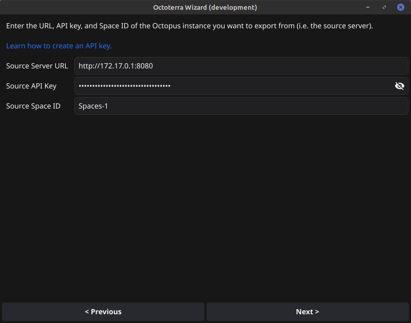

# OctoTerra Wizard

This tool prepares an Octopus space to allow space level resources and projects to serialized to a Terraform module and reapply them in another space.

[Linux](https://github.com/mcasperson/OctoterraWizard/releases/latest/download/octoterrawiz_linux_amd64)
[macOS](https://github.com/mcasperson/OctoterraWizard/releases/latest/download/octoterrawiz_macos_arm64)
[Windows](https://github.com/mcasperson/OctoterraWizard/releases/latest/download/octoterrawiz_windows_amd64.exe)

