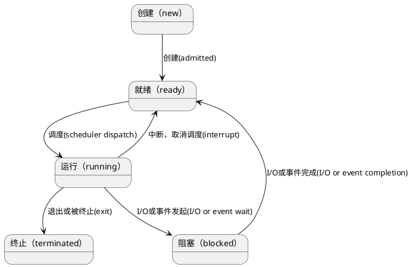
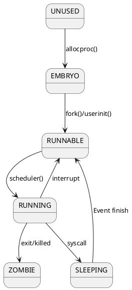

# 进程的定义

---

**非正式定义**

进程是运行中的程序

**怎么表示进程**

进程的机器状态可以用来表示进程。
进程的机器状态包括：

* 内存
  * 指令
  * 可读内存
  * 可写内存
* 寄存器
  * 通用寄存器，保存进行执行相关的数据
  * 特殊寄存器
    * 程序计数器（PC/IP），要执行的下一条指令
    * 栈指针（SP）函数调用栈，局部变量相关数据
* 进程访问的设备，即I/O相关信息（当前进程打开的文件列表）

# 进程相关API

**操作系统提供了哪些对进程的操作？**

* 创建
* 销毁
* 等待进程停滞
* 其他操作（暂停、恢复等）
* 获取进程状态

## 进程创建

**如何将程序转化为进程**

1. 从磁盘加载到内存
   1. 加载对象
      1. 代码
      2. 静态数据
   2. 加载方式
      1. 尽早加载（在进程执行之前全部加载）
      2. 惰性加载（用到的时候再加载）
2. 准备运行时栈
3. 完成其他初始化任务，例如I/O设备初始化、文件描述符
4. 启动程序，转移CPU控制权

## 进程状态



* running: 进程正在处理器上运行
* ready: 进程已经准备好，但是由于某种原因，操作系统选择不在此时运行
* blocked: 进程执行了某个操作，直到某个时间发生才会准备运行""

# xv6中进程相关数据结构

## 寄存器上下文

用于保存内核上下文切换时的寄存器数据。

```c
// proc.h
struct context {
  uint edi;
  uint esi;
  uint ebx;
  uint ebp;
  uint eip;
};
```

**类型**

这里用`uint32_t`会不会更加好一点，
如果64位的机器应该是`uint64_t`。

**缺少一些寄存器**

这里并不需要保存所有的段寄存器（例如：%cs），因为这些寄存器对于内核的
上下文切换来说是常量。

也不需要保存%eax、%ecx、%edx这些寄存器；因为按照x86的惯例， 这些寄
存器会被调用者保存在函数调用栈里。

**存储位置**

上下文的信息存储在它们所描述的栈的栈底位置；栈指针会指向上下文结构体。
上下文的内存布局符合`swtch.S`中在“切换栈”那段注释中对于栈的内存布局
的描述。

**eip**

切换内存地址的操作不需要显式地保存eip寄存器，但是这个寄存器是在栈里被
保存的；allocproc()这个函数会操作它。

## 进程状态枚举
进程可能处于的状态。

```c
// proc.h
enum procstate { UNUSED, EMBRYO, SLEEPING, RUNNABLE, RUNNING, ZOMBIE };
```

 * 1. UNUSED： 进程创建之前的状态。
 * 2. EMBRYO：胚胎状态，初始状态，进程在创建时处于的状态。
 * 3. SLEEPING：睡眠状态，等待某个事件发生以开始执行。
 * 4. RUNNABLE：已经准备好执行。
 * 5. RUNNING：正在处理器中执行。
 * 6. ZOMBIE：僵尸状态，已退出但未清理的最终状态。

**xv6进程状态转换图**


## 进程控制块
用于存储关于进程的信息。

```c
struct proc {
  uint sz;                     // 占用内存大小 (bytes)
  pde_t* pgdir;                // 指向页表的指针
  char *kstack;                // 该进程内核栈的底地址
  enum procstate state;        // 进程状态
  int pid;                     // 进程ID
  struct proc *parent;         // 父进程控制块
  struct trapframe *tf;        // 当前系统调用的trap frame
  struct context *context;     // 进程上下文
  void *chan;                  // 如果非零，指向睡眠队列
  int killed;                  // 如果非零，则被杀掉
  struct file *ofile[NOFILE];  // 打开的文件信息
  struct inode *cwd;           // 工作目录
  char name[16];               // 进程名（调试用）
};
```

**trap frame**

用来储存用户空间的寄存器。
调用trap陷入内核的时候（执行系统调用），
CPU从用户空间切换到了内核空间。
trap frame这段内存用来保存用户空间的寄存器数据。
